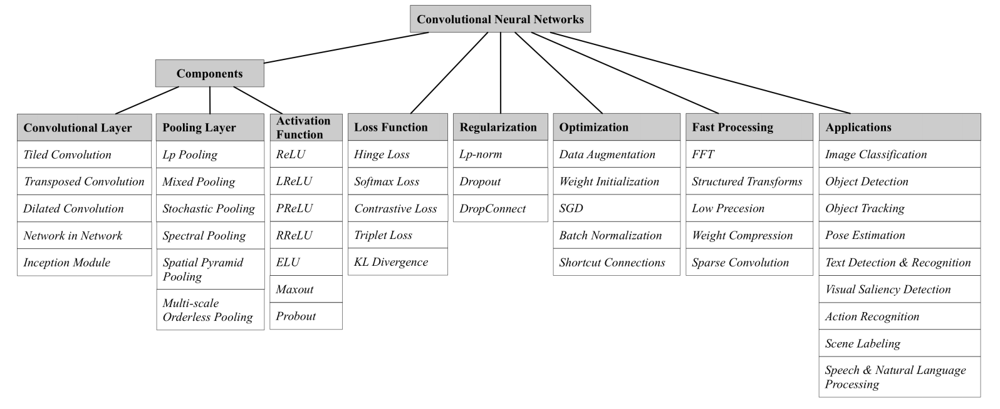
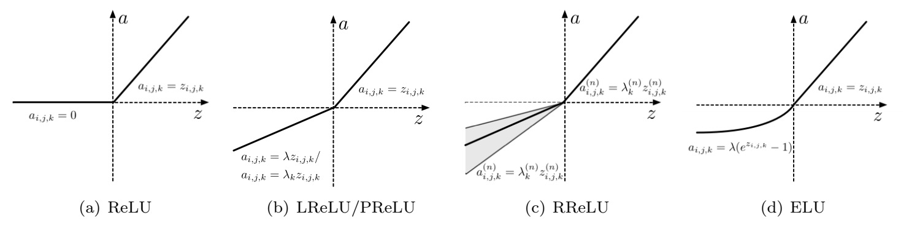
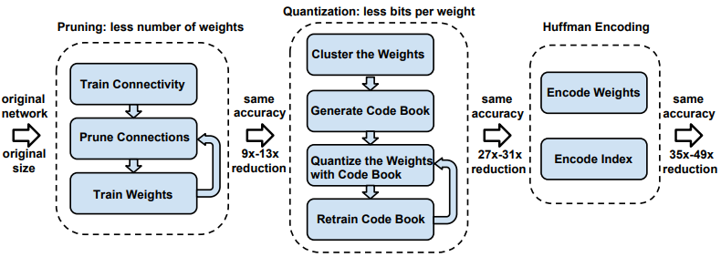

* * *

### Do Deep Nets Really Need to be Deep？

1. 论文基于 2 中的模型压缩技术，从实验角度去说明浅层网络也可以达到深层网络一样甚至更好的结果
2. 但它并不是直接基于原始训练数据训练一个浅层网络，而是先训练出一个 state of art 的深度网络，再用浅层网络去逼近深度网络（对于浅层网络的输入来说，其实是深度网络的输出数据，但不一定是最后一层结果）
3. 当然，本文只是从实验角度去说明这个问题，并没有从理论上分析

* * *

### Model Compression（KDD06）

1. 这是 06 年的[一篇论文](https://www.cs.cornell.edu/~caruana/compression.kdd06.pdf)，由 1 中链接而来，其中的方法比较 general，所以值得一读
2. 输入是高复杂度模型的输入数据，因为模型已知，所以对于简单网络来说，其输入数据就非常丰富了，且这些数据不会造成 overfit
3. 论文的另一个创新点在于，提出了一种生成无标签数据的方法 **MUNGE**

* * *

### Recent Advances in Convolutional Neural Networks  

1. [本文](https://arxiv.org/abs/1512.07108)发表于 2015 年，几大主流 CNN 框架也已经提出，本文主要讨论了 CNN 的基础、各项优化等，非常值得一读
2. 按 CNN 的构成划分如下：
3. 
4. 注意，对于分类问题，最后一层一般使用 Softmax，但也可以使用其它操作，如 SVM 等分类方法
5. 对 CNN 的优化可以从如下 6 个方面进行：
    1. 卷积层：直接从卷积结构上改造，可以支持不同的应用（如反卷积操作，就可以作用于视觉中不少问题，如 SR）[这里再特别注意 Inception Module]
    2. Pooling 层
    3. 激活函数：ReLU 在实践中优于 sigmoid & tanh 函数，也有不少对 ReLU 的改进工作
        1. 
        2. 另一个值得注意的是 Maxout 函数
    4. Loss 函数
    5. 正则化
        1. Lp 正则化
        2. Dropout：提高网络的泛化能力
    6. 优化方法（这里不仅仅只是数值优化 SGD 等的改进）
        1. 数据增强：在图像相关的算法上，可以通过增加随机旋转、平移、镜面翻转等手段，提高训练集多样性
        2. 参数初始化（很重要）：参数的选择不合理，可能会导致梯度爆炸或梯度消失问题，这里重点提到了 Xavier 初始化技术（知乎上也有对它的一个分析 https://zhuanlan.zhihu.com/p/22028079）
        3. SGD
        4. Batch Normalization：一般情况下，Normalization 用于对数据进行预处理，以保证输入数据符合一个标准的高斯分布，但随着数据在网络结构中的流动，中间层的数据极有可能会出现不标准分布（covariate shift problem），Batch Normalization 就是为了避免这种问题。
        5. Shortcut Connections：最近几年有很多这方面的工作，如 ResNet, HighwayNet 等，都是在网络中加入一个快速通路，直连某些层
6. CNN 相关应用（广泛应用于视觉及 NLP、文本分析等领域）

* * * 

### Batch normalization: Accelerating deep network training by reducing internal covariate shift

1. 复杂网络的训练过程中，非常容易出现 covariate shift 问题（随着前一层参数的调整，每层的输入数据分布都在发生变化），因此我们不得不将学习率调整得非常低，对初始参数也需要小心地进行初始化，这些因素实际上间接地导致训练过程比较慢。[本文](http://arxiv.org/pdf/1502.03167)尝试解决这个问题，使得我们可以用更大的学习率，也不需要太过关心初始化问题，甚至它在一定程度上还能替换掉 Dropout，实验结果表明 BN 非常有效。
2. <https://arxiv.org/pdf/1607.06450.pdf> 对该论文进行了改进

* * *

### Deep Compression: Compressing Deep Neural Networks With Pruning, Trained Quantization and Huffman Coding

1. 考虑到现在训练好的模型数据动不动就几百兆，所以对模型进行压缩非常重要，这篇文章就是解决这个问题。其整体架构图如下：
    - 
2. 从论文标题即可看出主要流程就是三步
    1. 对网络进行剪枝，去除掉不活跃的连接
    2. 对权重共享、量化等
    3. 对数据进行 Huffman 编码进一步压缩，消除冗余
2. 说明：作者 Han Song 有好几篇相关 Topic 的论文，都是值得一读的

* * *

### How transferable are features in deep neural networks?

1. [本文](http://papers.nips.cc/paper/5347-how-transferable-are-features-in-deep-neural-networks.pdf)探讨了很有趣的问题，即深度网络中学习到的特征可迁移性问题。
2. 当使用深度网络进行任务 A 的训练后，其学习的特征能否直接应用到任务 B，或者说学习到的哪一层的特征可迁移性很强，能用到任务 B 上呢？
3. 作者将 ImageNet 按类别划分成两个数据集，各自训练一个八层的神经网络 A 和 B，从第一层到第七层进行尝试，固定 A 的前 i 层，去训练 B 任务，看哪一层的特征表现的效果是最好的，对 B 也做如此操作，然后比较哪一层学习出来的 feature 可迁移性最强
4. 结论：使用迁移性强的 feature 可以提高整个网络的泛化性能
5. 作者也提供了代码，参考 <http://yosinski.com/transfer>

* * *

### Visualizing and Understanding Convolutional Networks

1. 这篇论文基本上是深度学习领域里一个很有影响力的工作，对深度学习各层学习到的特征进行可视化，更好地指导进行网络结构及参数的优化
