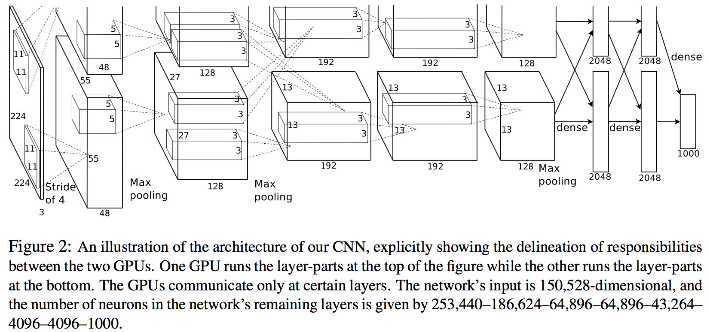

本周主要看 ImageNet 演进过程中各类经典网络结构相对应的论文，包括 AlexNet, VGGNet, GoogLeNet, ResNet，其中有些网络结构随着后来的不断迭代更新，已经有了诸多版本，如 GoogLeNet 就已经演进到[第四代](http://arxiv.org/abs/1602.07261)，整体错误率也在不断刷新。

### Imagenet classification with deep convolutional neural networks

1. 这是深度学习兴起的开山之作，其提出的网络结构也被称为 AlexNet。作者的行文结构也很清晰，提出使用深度 CNN 进行训练以后，从多个方面来说明影响结果的几大因素，主要包括：
    1. 使用 ReLU 替代传统激活函数：这一点其实已经没啥好解释的了，sigmoid 函数由于其本身的特性容易出现梯度消失、导致训练收敛速度过慢等问题，ReLU 在一定程度上很好地修正了这个问题，不仅能够在一定程度上缓解梯度消失的问题、也提高了收敛的速度。
    2. 多 GPU 的并行训练：
    3. Local Response Normalization：从之后的很多论文分析来看，这一步似乎是可以省略的（参考 VGG 论文）
    4. Dropout
    5. 数据增强
2. AlexNet 结构如下：（为什么 input 是 224*224 呢？因为作者在数据增强这一步中对原始图像进行了随机的裁剪）
    - 

### Very deep convolutional networks for large-scale image recognition

1. VGGNet
2. https://arxiv.org/pdf/1409.1556.pdf

### Going deeper with convolutions
1. GoogLeNet
2. v1 -> v4 <http://blog.csdn.net/u010025211/article/details/51206237>
3. <http://www.cv-foundation.org/openaccess/content_cvpr_2015/papers/Szegedy_Going_Deeper_With_2015_CVPR_paper.pdf>

### Deep residual learning for image recognition

1. ResNet
2. <https://arxiv.org/pdf/1512.03385.pdf>

### Densely Connected Convolutional Networks

1. DenseNet
2. [Memory-Efficient Implementation of DenseNets](https://arxiv.org/pdf/1707.06990.pdf)