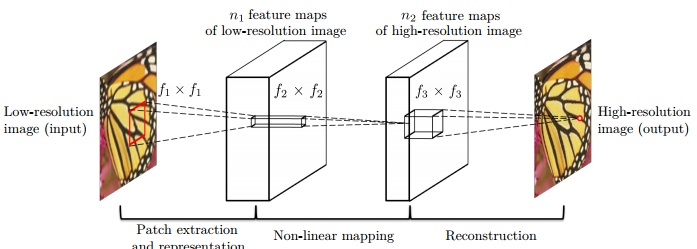

### Image Super-Resolution Using Deep Convolutional Networks

论文链接：<https://arxiv.org/pdf/1501.00092.pdf>

这是深度学习在图像超分辨率中的第一篇论文，称为 SRCNN，其架构如下：



文中先训练一个三层网络，这三层网络表示的意义分别如下：

1. 区块提取及特征表示
2. 非线性映射
3. 重建

将一张低分辨率图片通过双线性插值提升分辨率（称为 LR）后，将它输入到三层网络，同时使用 MSE 作为损失评估函数。最后得到了一个当时 State Of Art 的结果。下面是[另一篇改进文章](https://arxiv.org/abs/1609.05158)的网络结构，可以看到，非常地简洁。

```python
class Net(nn.Module):
    def __init__(self, upscale_factor):
        super(Net, self).__init__()

        self.relu = nn.ReLU()
        self.conv1 = nn.Conv2d(1, 64, (5, 5), (1, 1), (2, 2))
        self.conv2 = nn.Conv2d(64, 64, (3, 3), (1, 1), (1, 1))
        self.conv3 = nn.Conv2d(64, 32, (3, 3), (1, 1), (1, 1))
        self.conv4 = nn.Conv2d(32, upscale_factor ** 2, (3, 3), (1, 1), (1, 1))
        self.pixel_shuffle = nn.PixelShuffle(upscale_factor)

        self._initialize_weights()

    def forward(self, x):
        x = self.relu(self.conv1(x))
        x = self.relu(self.conv2(x))
        x = self.relu(self.conv3(x))
        x = self.pixel_shuffle(self.conv4(x))
        return x

    def _initialize_weights(self):
        init.orthogonal(self.conv1.weight, init.calculate_gain('relu'))
        init.orthogonal(self.conv2.weight, init.calculate_gain('relu'))
        init.orthogonal(self.conv3.weight, init.calculate_gain('relu'))
        init.orthogonal(self.conv4.weight)
```

### You Only Look Once: Unified, Real-Time Object Detection

### YOLO9000: Better, Faster, Stronger

