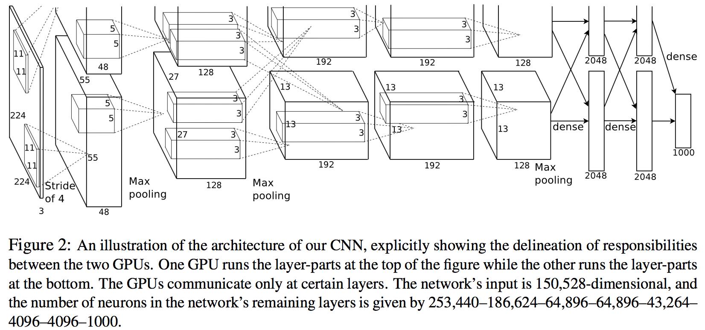
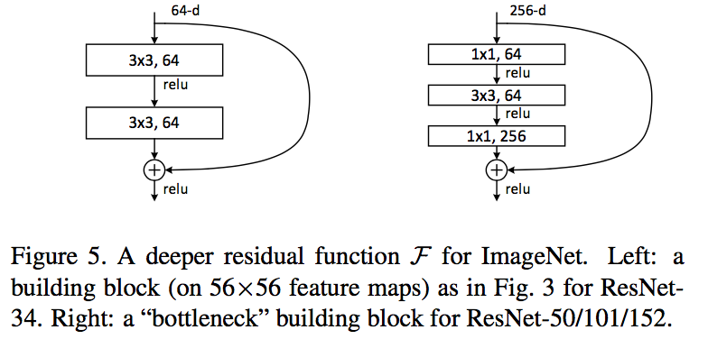

本周主要看 ImageNet 演进过程中各类经典网络结构相对应的论文，包括 AlexNet, VGGNet, GoogLeNet, ResNet，其中有些网络结构随着后来的不断迭代更新，已经有了诸多版本，如 GoogLeNet 就已经演进到[第四代](http://arxiv.org/abs/1602.07261)，整体错误率也在不断刷新。

有关整个 CNN 框架相关的变迁，可以看下 <http://cs231n.stanford.edu/slides/2017/cs231n_2017_lecture9.pdf>

### Imagenet classification with deep convolutional neural networks

1. 这是深度学习兴起的开山之作，其提出的网络结构也被称为 AlexNet。作者的行文结构也很清晰，提出使用深度 CNN 进行训练以后，从多个方面来说明影响结果的几大因素，主要包括：
    1. 使用 ReLU 替代传统激活函数：这一点其实已经没啥好解释的了，sigmoid 函数由于其本身的特性容易出现梯度消失、导致训练收敛速度过慢等问题，ReLU 在一定程度上很好地修正了这个问题，不仅能够在一定程度上缓解梯度消失的问题、也提高了收敛的速度。
    2. 多 GPU 的并行训练：
    3. Local Response Normalization：从之后的很多论文分析来看，这一步似乎是可以省略的（参考 VGG 论文）
    4. Dropout
    5. 数据增强
2. AlexNet 结构如下：（为什么 input 是 224*224 呢？因为作者在数据增强这一步中对原始图像进行了随机的裁剪）
    - 

### Very deep convolutional networks for large-scale image recognition

1. VGGNet 是一个很经典的网络结构，其简单之处在于，将 AlexNet 加深的同时，整个网络结构只使用 3x3 的卷积核和 MaxPooling 操作，并且通过实验表明："the deeper, the better"。但是，里面包含的多层全连接导致整个参数数量过多。
2. https://arxiv.org/pdf/1409.1556.pdf

### Going deeper with convolutions
1. GoogLeNet
2. v1 -> v4 <http://blog.csdn.net/u010025211/article/details/51206237>
3. <http://www.cv-foundation.org/openaccess/content_cvpr_2015/papers/Szegedy_Going_Deeper_With_2015_CVPR_paper.pdf>

Inception 网络结构的核心思想是提出了 Inception 模块，并行使用 1x1，3x3，5x5 的卷积核，将输出结果 concat 到一起再输入到下一个 Inception 模块。与过去的网络结构不同之处在于，它让 Neural Network 自己去选择合适的卷积核（不合适的会被弱化，参数趋于 0）。

此外，1x1 卷积核的使用，可以大大减小参数量。具体的计算可以参考：https://hacktilldawn.com/2016/09/25/inception-modules-explained-and-implemented/

### Deep residual learning for image recognition

1. [这篇论文](https://arxiv.org/pdf/1512.03385.pdf)提出残差网络结构 ResNet，解决随着网络结构加深导致难以训练的问题。开篇提出问题：“Is Deep Better”，但从实验结果来看，随着深度到达一定程度后，再加深网络反而会导致结果更糟糕（作者观察到，并不是过拟合导致，因为训练误差也反而增加），同时，因为使用了 BN、ReLU 等手段，梯度消失的问题也被缓解，所以并非完全是梯度消失所造成的。文中提出在中间层之间增加一个单位元连接来达到残差学习的目的，在一定程度上缓解上面的这个问题。
2. 文中做了大量的对比实验，如普通的 Network，到了一定深度后，随着加深会导致训练误差反而增加，对比 18 层正常网络与残差网络，结果相近但残差网络收敛得更快
3. 为训练更深层的网络同时，避免复杂度的大幅提升，引入了 Bottleneck Block
    - 

### Densely Connected Convolutional Networks

1. DenseNet
2. [Memory-Efficient Implementation of DenseNets](https://arxiv.org/pdf/1707.06990.pdf)
