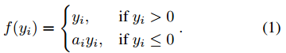

## RCNN 系列

1. [Rich Feature Hierarchies for Accurate Object Detection and Semantic Segmentation](https://arxiv.org/pdf/1311.2524.pdf)
2. [Fast R-CNN](https://arxiv.org/pdf/1504.08083.pdf)
3. [Spatial Pyramid Pooling in Deep Convolutional Networks for Visual Recognition](https://arxiv.org/pdf/1406.4729.pdf)
3. [Faster R-CNN: Towards Real-Time Object Detection with Region Proposal Networks](https://arxiv.org/pdf/1506.01497.pdf)
3. [Mask-RCNN](https://arxiv.org/pdf/1703.06870.pdf)

## 其它

### Delving Deep into Rectifiers: Surpassing Human-Level Performance on ImageNet Classification

本文中，[He etc.] 提出了 PReLU 和 MSRA-initializer，并基于这两项改进把 ImageNet 识别错误率降到了 5% 以内。

PReLU 定义如下：

其中的参数在训练中去计算得到，文中探讨了两种（一种是各通道共享同一个参数，另一种是每个通道有各自的参数），从结果上看，channel-wise 会比 channel-shared 略好。

而 MSRA-initializer 的提出则是为了弥补 Xavier-initializer 基于线性假设这一劣势导致其无法应用到 Rectified 激活函数上。这一小节的分析过程，非常值得一读。同时其中也有非常细致地与 Xavier-initializer 对比工作。

### Aggregated Residual Transformations for Deep Neural Networks

这是 ResNet 的一个改进，称为 ResNeXt，FaceBook 目前很多的网络基础都是基于此。其思想与 Inception 的改进 [Xception](https://arxiv.org/abs/1610.02357) 有点类似，都是从 block 的宽度上进行改进。