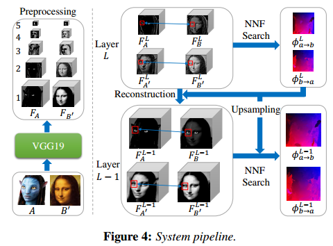

### A guide to convolution arithmetic for deep learning

包含各种卷积（包含转置卷积）运算

### O-CNN: Octree-based Convolutional Neural Networks for 3D Shape Analysis

这是 SIGGRAPH 2017 上关于几何形状分析与深度学习结合相关的论文，通过构建 octree 提高 CNN 处理的体素分辨率。

深度学习与三维几何分析结合的方法主要包括：

1. 基于体素的方法：这种方法最大的问题在于时空复杂度巨大，而且难以处理高分辨率的体素模型。
2. 基于流形的方法：[Bronstein et al. 2017] 有很好的总结。这种方法先提取模型的几何特征（2D Patch），转换为 2D CNN，但前提是要求模型足够 smooth，拓扑性质良好，且对噪声比较敏感。
3. 基于多视图的方法：受限于视图角度问题。
4. 其它深度学习相关方法：主要了解下 PointNet 相关内容

### Visual Attribute Transfer through Deep Image Analogy

MSRA 2017 年 SIGGRAPH 上的一篇论文，其核心要解决的问题是对于相同语义（semantic）不同风格（visual style）的图片之间的转换。给定图像 A 与 B'，我们需要找到 A 与 B' 中同语义的部分建立对应关系，生成 A' 与 B，使得 (A, A') 和 (B, B') 分别在内容上保持一致，(A, B) 和 (A', B') 分别在风格上保持一致。本文主要包括三块内容：

1. 建立 A 与 B' 的语义对应关系
2. 重建 A' 与 B
3. Deep PatchMatch

