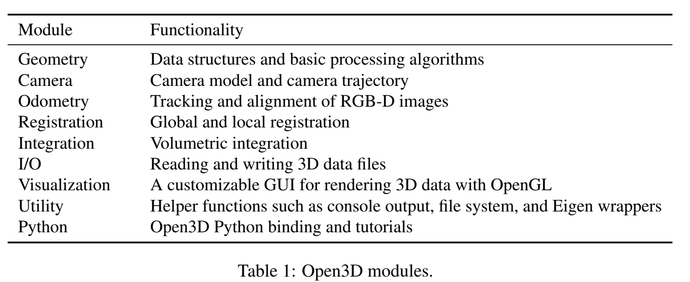

### PointCNN

参考链接：<https://arxiv.org/abs/1801.07791>

提出了一个从无序点云中提取特征的方法，提取学习一个 $\chi$ 变换方法，是一种对 CNN 扩展的通用方法。

### Open3D: A Modern Library for 3D Data Processing

论文链接：<https://arxiv.org/pdf/1801.09847.pdf>

1. Intel 公开的一个现代 3D 处理库，前端使用 Python & C++
2. 支持三种基本 3D 数据：Mesh、点云、RGBD，同时包括了三维重建、ICP、点云法向估计等功能
3. 代码库链接：<https://github.com/IntelVCL/Open3D>

